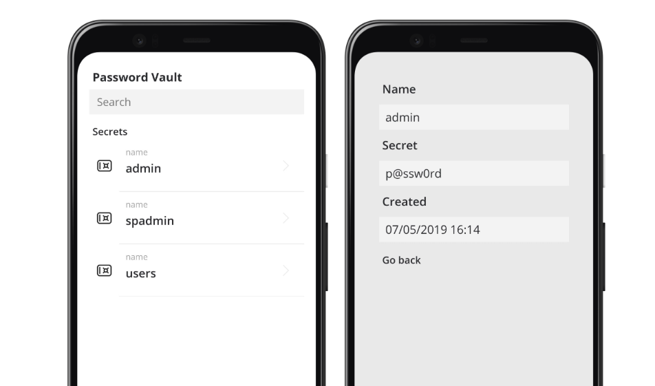

# PowerApps-Cookbook
Chapter 06 material, published by Packt

# PowerVault
Use the provided package to import this solution into your environment.

1. Go to [Power Apps](https://make.powerapps.com)
2. From the left menu click on **Apps** and then **Import canvas app** from the toolbar
3. Upload the provided **PowerVault.zip** solution file and continue with the import wizard

